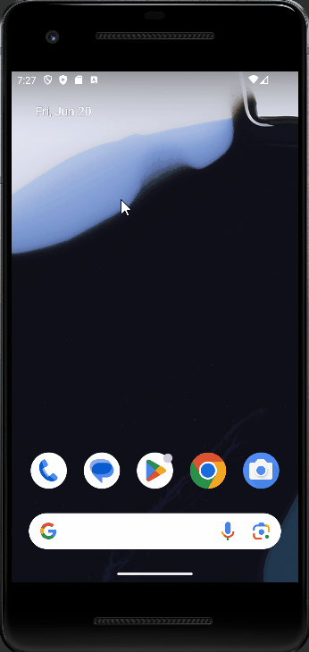

# ClayEngineVK Demo Android Mobile

Demo application of the ClayEngineVK static library (https://github.com/VadimEngine/ClayEngineVK) showcasing building an Android Mobile application with Vulkan. 

## Scenes

### Menu Scene

Scene to select which scene to render

### Sandbox Scene

Simple scene that render loaded models and materials. Can also go back to the Menu scene.

## Build

Apply fix for physx
`patch -p0 -i patches/physx_fixes.patch`

Update Submodules
- `git submodule update --init --recursive`

compile shaders
- `./res/compile_shaders.bat`

build CLI:
- `./gradlew clean assembleDebug`
- `./gradlew clean build`

The build `app-debug.apk` will be `.\app\build\intermediates\apk\debug\app-debug.apk` can be deployed to an Oculus device

Alternatively, this can be built and deployed with Android studio.

Note: For debug mode, ./app/src/main/jniLibs must be added with vulkan validation shared objects
- `libVkLayer_core_validation.so`
- `libVkLayer_khronos_validation.so`
- `libVkLayer_object_tracker.so`
- `libVkLayer_parameter_validation.so`
- `libVkLayer_threading.so`
- `libVkLayer_unique_objects.so`
